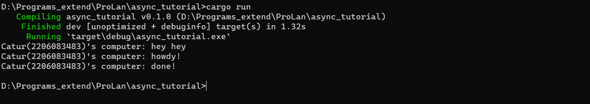
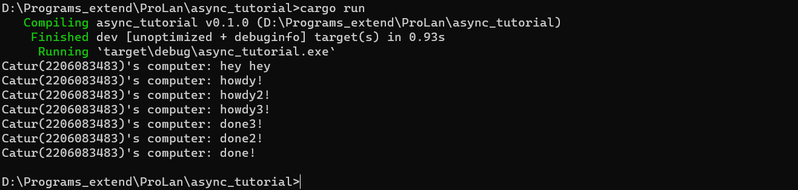
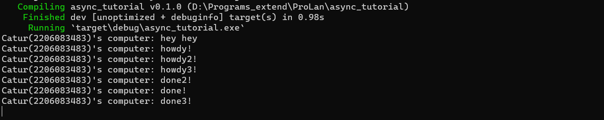

# Refleksi tutorial async
1.2. Understanding how it works

Apa yang terjadi adalah bagian main program mendeklarasi sebuah executor async yang disuruh untuk mengeprint howdy dan done, namun sebelum executor sempat di run, bagian main mencapai kode untuk mengeprint hey hey terlebih dahulu sehingga hey hey diprint terlebih dahulu setelah itu executor dijalankan dan melaksanakan tugasnya.

1.3. Multiple spawn

Sepertinya ketika done digunakan, setelah main selesai dijalankan, program akan mati dengan sendirinya. Namun, jika done tidak digunakan program tersebut tidak akan berhenti kecuali dimatikan dengan paksa melalui ctrl + c. Hal tersebut mungkin karena spawner menghentikan program dari mati ketika menunggu masukan tambahan sehingga spawner harus ditutup agar program bisa mati dengan sendirinya.

Selain itu, pada multiple spawn. Sepertinya ketika dieksecute ketiga hal tersebut berjalan dalma waktu yang hampir sama dan juga tidak terpengaruh oleh wait dari spawn yang lain. Hal tersebut bekerja seakan-akan tiap spawn adalah sebuah thread yang dijalankan dalam waktu yang bersamaan ketika dilaksanakan execute.